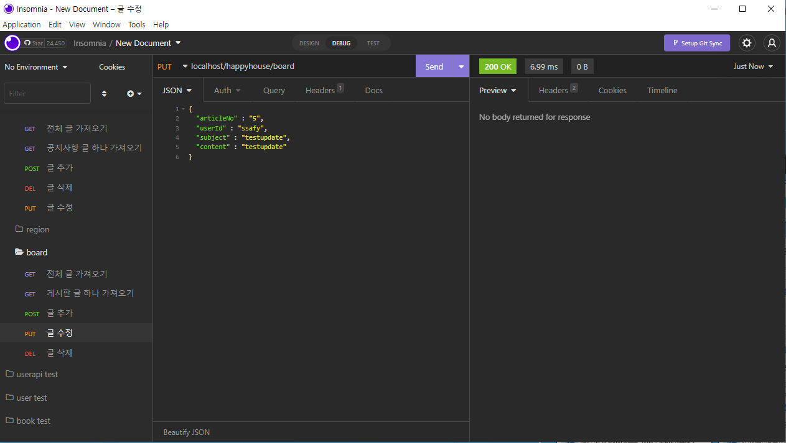

# HappyHouse REST API PROJECT
> 아파트 거래 정보 제공 사이트에 대한 REST API 설계 및 구현

## REST API 설계

## 구현 테스트

> insomnia tool을 이용한 REST 통신 결과입니다.

### 지역 LIST

### Apt 
|관심 지역 추가|관심 지역 삭제|
| ---------| ---------|
||

|관심 아파트 추가|관심 아파트 삭제|
| ---------| ---------|
|||

### User 
|로그인|로그아웃|
| ---------| ---------|
|||

|전체 유저 가져오기|상세보기|
| ---------| ---------|
|||

|추가|추가 후 전체 유저 가져오기|
| ---------| ---------|
|||

|수정|수정 후 전체 유저 가져오기|
| ---------| ---------|
|||

|삭제|삭제 후 전체 유저 가져오기|
| ---------| ---------|
|||

### Board
|전체 글 가져오기|상세보기|
| ---------| ---------|
| | 

|추가|추가 후 전체 글 가져오기|
| ---------| ---------|
| | |

|수정|수정 후 전체 글 가져오기|
| ---------| ---------|
| | |

|삭제|삭제 후 전체 글 가져오기|
| ---------| ---------|
|||

### Notice
|전체 글 가져오기|상세보기|
| ---------| ---------|
|||

|추가|추가 후 전체 글 가져오기|
| ---------| ---------|
|||

|수정|수정 후 전체 글 가져오기|
| ---------| ---------|
|||

|삭제|삭제 후 전체 글 가져오기|
| ---------| ---------|
|||

## 향후 개발 내용

* 0.0.1
    * REST API 설계
* 0.0.2
    * swagger 추가 예정
* 0.0.3
    * vue.js를 이용한 Front 설계
 * 0.0.4
    * Spring Secuity를 이용한 jwt 사용

